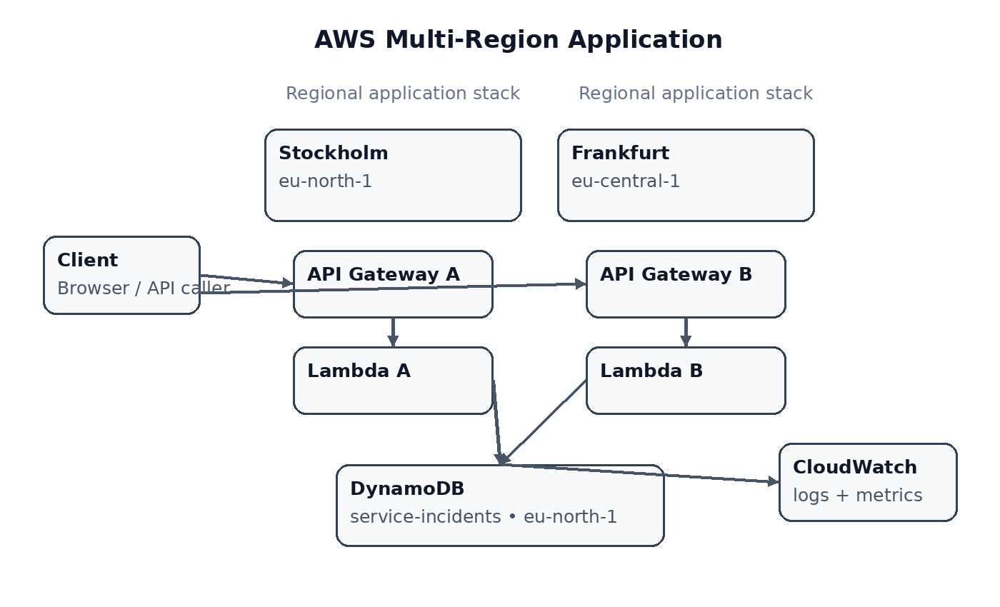

# AWS Multi-Region Active-Active Architecture Design

**Regions:** Stockholm (`eu-north-1`) and Frankfurt (`eu-central-1`)

## Live API Demo

### Region A — Stockholm
GET /incident/INC001

https://m6j2wmh6y8.execute-api.eu-north-1.amazonaws.com/incident/INC001

### Region B — Frankfurt
GET /incident/INC001

https://oj39ryo86l.execute-api.eu-central-1.amazonaws.com/incident/INC003

## Project overview

This project demonstrates a serverless, multi-region application layer on AWS. The same incident API is deployed in two AWS Regions so that both regional stacks can independently receive and process requests.

The current implementation uses:

- Amazon API Gateway HTTP API
- AWS Lambda
- Amazon DynamoDB
- Amazon CloudWatch

## Architecture



### Request flow

**Region A — Stockholm**

`Client → API Gateway A → Lambda A → DynamoDB (Stockholm)`

**Region B — Frankfurt**

`Client → API Gateway B → Lambda B → DynamoDB (Stockholm)`

The two regional Lambda functions return the region that processed the request, making the multi-region behavior easy to demonstrate.

## Live endpoints

### Region A — Stockholm

`GET https://m6j2wmh6y8.execute-api.eu-north-1.amazonaws.com/incident/INC001`

### Region B — Frankfurt

`GET https://oj39ryo86l.execute-api.eu-central-1.amazonaws.com/incident/INC001`

Both endpoints were tested successfully and returned the same `INC001` incident record.

## Sample output

### Region A

```json
{
  "message": "Incident found",
  "region": "eu-north-1",
  "incident": {
    "incidentId": "INC001",
    "createdAt": "2026-09-28T18:00:00Z",
    "title": "Road service interruption",
    "status": "OPEN"
  }
}
```

### Region B

```json
{
  "message": "Incident found",
  "region": "eu-central-1",
  "incident": {
    "incidentId": "INC001",
    "createdAt": "2026-09-28T18:00:00Z",
    "title": "Road service interruption",
    "status": "OPEN"
  }
}
```

## AWS resources

| Component | Region | Resource |
|---|---|---|
| DynamoDB | Stockholm | `service-incidents` |
| Lambda | Stockholm | `service-incidents-region-a` |
| API Gateway | Stockholm | `service-incidents-api-region-a` |
| Lambda | Frankfurt | `service-incidents-region-b` |
| API Gateway | Frankfurt | `service-incidents-api-region-b` |
| CloudWatch | Both | `service-incidents-multiregion` |

## Monitoring

The CloudWatch dashboard `service-incidents-multiregion` contains four widgets:

- Invocations — Region A
- Invocations — Region B
- Errors — Region A
- Errors — Region B

## IAM

Both Lambda functions use permission to call `dynamodb:GetItem` on the `service-incidents` table in `eu-north-1`.

## Important implementation limitation

This is a **simplified multi-region active-active compute/API demonstration**. The application/API and Lambda layers are deployed in two regions, but the DynamoDB table is currently single-region in Stockholm.

DynamoDB Global Tables and a global cross-region traffic-routing layer were not included in the current Free Plan implementation. Therefore, this repository does **not** claim full end-to-end active-active data-plane independence.

## Demo flow

1. Open the Region A endpoint and request `INC001`.
2. Show that the response identifies `eu-north-1`.
3. Open the Region B endpoint and request `INC001`.
4. Show that the response identifies `eu-central-1`.
5. Open DynamoDB and show the `INC001` record.
6. Open CloudWatch and show invocations/errors for both Lambda functions.

## Future improvements

For a production-grade multi-region design, the next steps would include a supported global traffic-routing strategy, multi-region data replication, authentication/authorization, infrastructure as code, alarms, and automated deployment.

## Team

- VINUKONDA STEVEN JOY
- VALLETI ANJANI HIMABINDU
- KARUMURI P R N S RAJESWARARAO
- YENGALA DHARANI KUMAR
